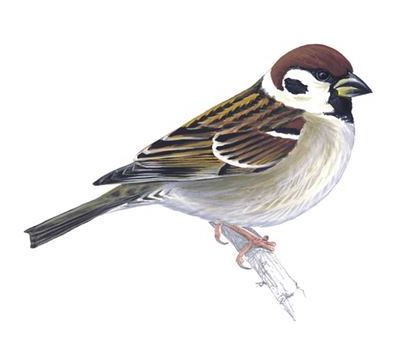
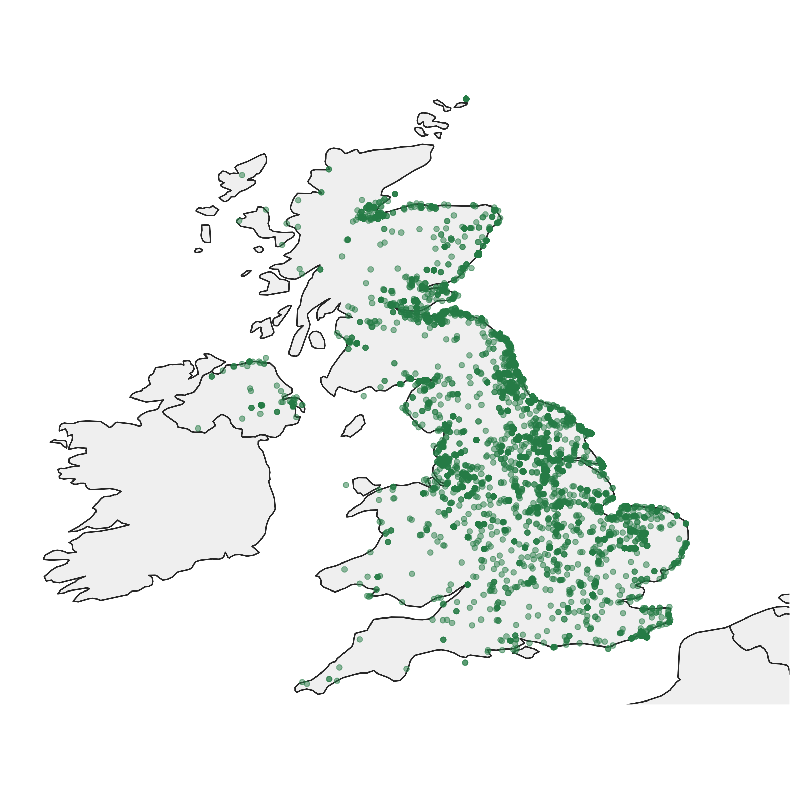
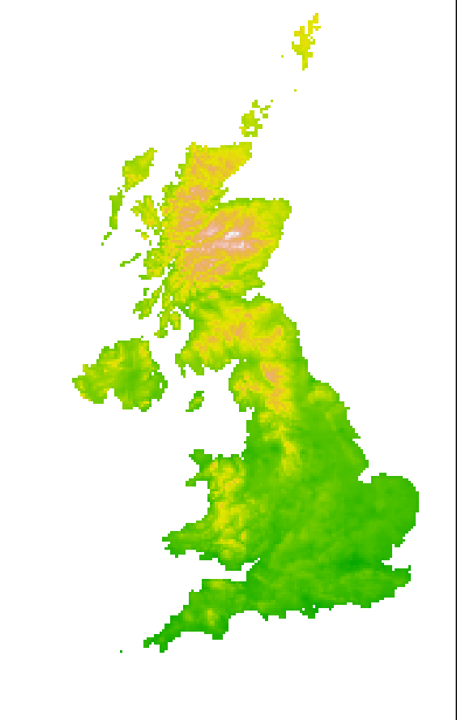
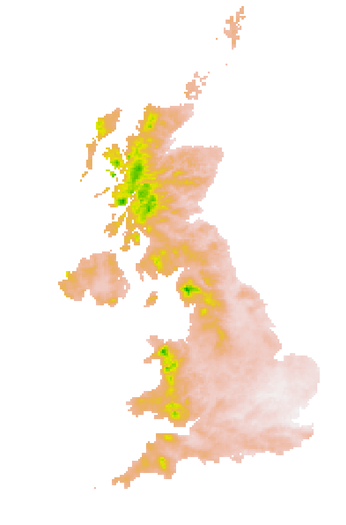
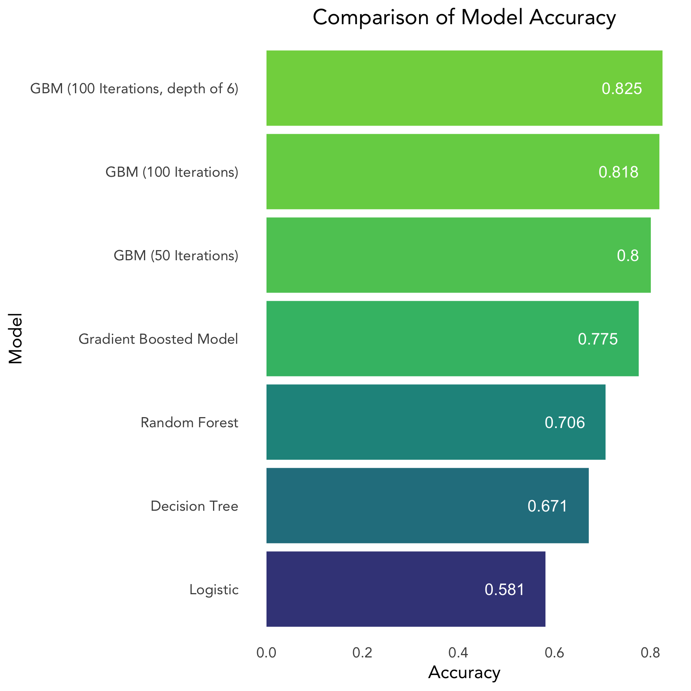
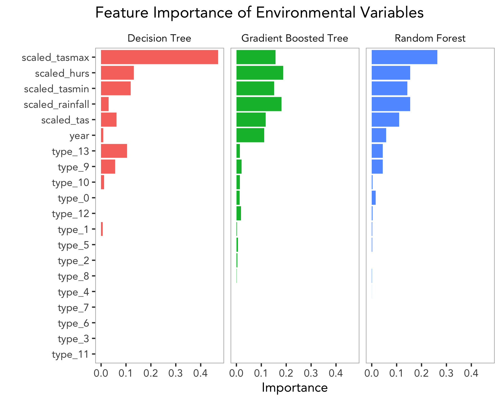
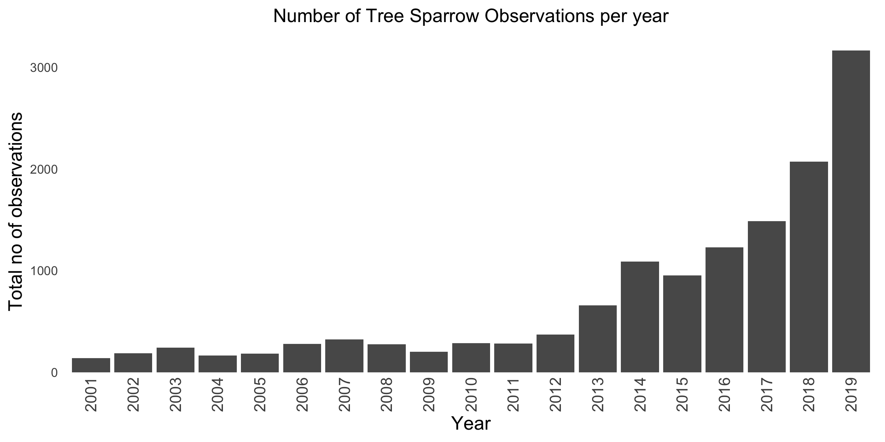
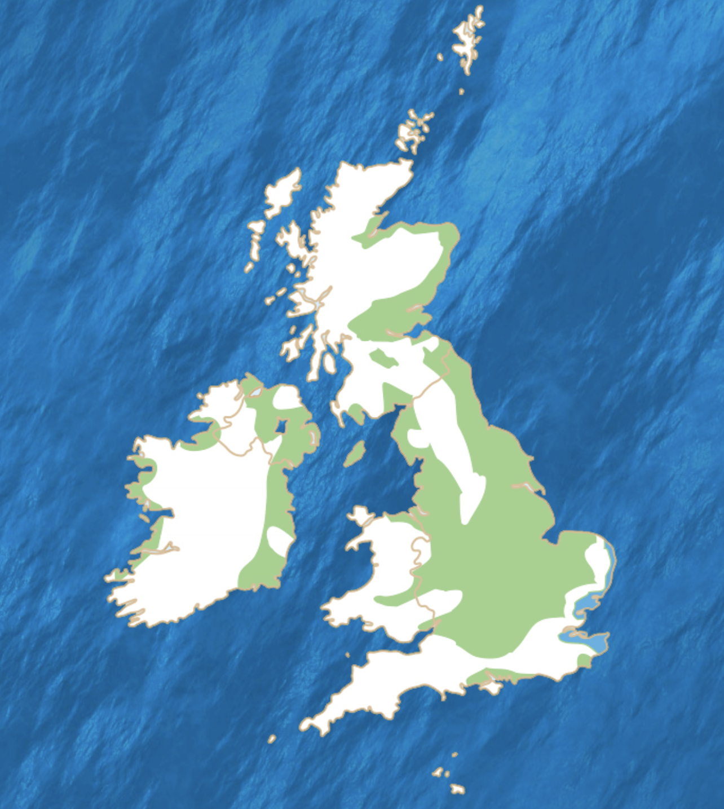

```{r setup, include=FALSE}
knitr::opts_chunk$set(echo = TRUE)
system('java -version')
library(sparklyr)
packageVersion('sparklyr')
library(dplyr)
library(geospark)
library(ggplot2)
library(corrr)
library(dbplot)
library(maps)
library(viridis)
require(knitr)


# Set up spark connection
sc <- spark_connect(master = "local", version = "2.3")
## 2.0 DATA IMPORTS ####
# Load in Data set for Analysis (final_data.csv)
# Load raw GBIF dataset (Tree Sparrow) (passer-montanus.csv)
# Load world map data for mapping observation locations

data <- spark_read_csv(sc, "final_data.csv")
pm_data <- spark_read_csv(sc, "passer-montanus.csv")
world <- map_data('world')
```

[Link to Github Respoitory](https://github.com/FlorenceGalliers/big-data) https://github.com/FlorenceGalliers/big-data

# Introduction
An increasing number of species are being added to the global red list for being at risk of extinction (IUCN, 2021). On a local scale, regular species surveys allow population trends to be monitored and relevant conservation action taken if needed. These surveys undertaken by organisations or conservation groups are usually well structured and can be accurately compared year on year to create time-series data of species populations. An example of the use of this data is the construction of the UK Farmland Bird Indicator which summarises the combined population trends of 19 species. It showed a decline of 55% between 1970 and 2018 (RSPB, 2021). Today, over half of these farmland bird species are on the UK Conservation Red List. This is a growing number, due to a variety of factors, including intensification of farming practices, larger field sizes and increased application of chemicals such as pesticides to the ground.

Increasing in popularity is the use of citizen science data (Aceves‐Bueno et al., 2017), such as that which can be found on the Global Biodiversity Information Facility (GBIF, www.gbif.org), which is a network that gives free open access to biodiversity data. This data is collated from a huge variety of sources including human observations. This data can be used for investigating the distribution and abundance of species and the interactions of biodiversity with the environment. The data available on GBIF can be considered big data as it is a continuously expanding dataset in terms of its volume, variety and veracity. 

The Tree Sparrow will be the focus of this study as it had the largest negative population trend (-94%) in the UK Farmland Bird Indicator 1970-2007 (RSBP, 2021). However, in the last 10 years it has been reported to have an increased breeding population, despite being severely depleted in comparison to historic populations (Woodward et al., 2018). Observation data from the Tree Sparrow will be combined with environmental variables and used to investigate the effects of these variables on species distribution. By using this data, we can gain more of an insight into the interactions between species and their environment. 

```{r, echo = FALSE, fig.cap="", out.width="5in", out.height="5in"}


```

The **objectives** of this study are to assess (1) which environmental variables are most influential on the number of bird observations and (2) if GBIF observation data is in agreement with other, more structured sources of species data, in particular for species featured on the Red List.

```{r include = FALSE}
pm_plot <- pm_data %>%
  select(decimalLongitude, decimalLatitude, year) %>%
  filter(year >= 2001) %>%
  collect() %>% 
  ggplot() + 
  geom_polygon(data = world, 
                        aes(x = long, 
                            y = lat, 
                            group = group),
                        fill = "grey95",
                        color = "grey20") + 
  coord_fixed(ratio = 1.2,
              xlim = c(-10,3), 
              ylim = c(50.3, 59)) +
  theme_minimal() +
  geom_point(pm_data,
             mapping = aes(x = decimalLongitude,
                 y = decimalLatitude),
             color = "seagreen4",
             alpha = 0.5) +
  labs(title = "Tree Sparrow (Passer Montanus) Observations\nin the UK 2001 - 2019",
       x = "",
       y = "") +
  theme(
    plot.title = element_text(size = 12,
                              hjust = 0.5),
    axis.text = element_blank(),
    legend.position = "none",
    panel.grid = element_blank()
  )

```

```{r include = FALSE}
pm_data$year <- as.factor(pm_data$year)

time_plot <- pm_data %>%
  group_by(year) %>%
  filter(year >= 2001) %>%
  summarise(sum = n()) %>%
  collect() %>%
  ggplot(aes(x = as.character(year), y = sum)) +
  geom_bar(stat = "identity") +
  labs(title = "Number of Tree Sparrow Observations per year",
       x = "Year",
       y = "Total no of observations") +
  theme_minimal() +
  theme(
    plot.title = element_text(size = 12,
                              hjust = 0.5),
    axis.title = element_text(size = 12),
    axis.text = element_text(size = 8),
    axis.text.x = element_text(angle = 90, hjust = 1, 
                               size = 10, vjust = 0.5, 
                               margin=margin(-10,0,0,0)),
    panel.grid = element_blank())

```

```{r include = FALSE}
# look at average values of all data
summarise_all(data, mean) 

# Selected needed columns
data2 <- data %>%
  select(Count, tas, tasmin, tasmax, rainfall, hurs, land, year)

# Look at correlation between variables
ml_corr(data2)

correlate(data2, use = "pairwise.complete.obs", method = "pearson") %>%
  shave() %>%
  rplot()

# Look at distributions of temperature variables
temp_plot <- data2 %>%
  select(tas, tasmin, tasmax) %>%
  pivot_longer(names_to = "type", 
               values_to = "temperature",
               cols = 1:3) %>%
  ggplot(aes(x = type, y = temperature)) +
  geom_boxplot() +
  geom_point(position = "jitter", alpha = 0.3)

```
\newpage 
# Data

## Observation Data
The eBird Dataset (Levatich and Ligocki, 2020) is managed by the Cornell Lab of Ornithology, it combines global bird observation data and is accessible via GBIF. The dataset contains over 705 million observations worldwide, with 8 million of these from the UK. The full dataset is over 180GB and is far too large to download locally and manipulate in R. For this study a subset of this data is used, however the quantity of available data should be noted as there is potential to scale this analysis up to use more data. 

From the GBIF website, observations of the Tree Sparrow (Passer montanus) in the UK between 2001 and 2019 were downloaded (GBIF, 2021). The locations of the downloaded observations are shown in Figure 1, there were 14,902 observations in total.
```{r, echo = FALSE, fig.cap="Tree Sparrow (Passer montanus) observations in the UK, 2001 - 2019", out.width="5in", out.height="5in"}


```

When downloading data directly from GBIF, over 50 columns of data for observation are downloaded. From these, only a the locations and year of observation was selected for use (Table 1).

| Variable Description | Variable Name |
|--------------------------|--------------|
| Latitude of observation | decimalLatitude |
| Longitude of observation | decimalLongitude |
| Year of observation | year |
Table 1: Subset of columns of raw data downloaded from GBIF.

## Climate Data
Climate data was downloaded from the HadUK-Grid Gridded Climate Observations 5km grid UK dataset, v1.0.2.1 (1862-2019) (Hollis et al, 2019). Five annual climate variables were selected to be used from this data set (Table 3). Raw files for the years between 2001 and 2019 were downloaded from the CEDA Archive (https://catalogue.ceda.ac.uk) and were in ‘.nc’ file formats. Before data can be extracted for analysis, they were converted into data frames. This process was completed in a separate script from the main analysis (“data-preparation.R”). For each observation of the Tree Sparrow, the five climate variable values were extracted. 

```{r, echo = FALSE, fig.cap="Average Annual Temperature UK, 2019", out.width="3in", out.height="3in"}

```

```{r, echo = FALSE, fig.cap="Average Annual Rainfall UK, 2019", out.width="3in", out.height="3in"}

```

## Land Use Data
Land classification data was downloaded from the MODIS Land Cover Dataset (Friedl and Sulla-Menashe, 2019) which provides global land cover information for the years 2001 – 2019. Land Cover Type 2 was used which splits land cover into 16 different classifications, these are detailed below (Table 2). From the raw files, the land classification in the location of each observation was extracted. 

|Class  |	Name |	Description |
|-------|---------------|---------------------------|
|0 | Water bodies |	At least 60% of area is covered by permanent water bodies.|
| 1 |	Evergreen Needleleaf Forests |	Dominated by evergreen conifer trees (canopy >2m). Tree cover >60%. |
| 2	| Evergreen Broadleaf Forests |	Dominated by evergreen broadleaf and palmate trees (canopy >2m). Tree cover >60%. |
| 3	| Deciduous Needleleaf Forests | 	Dominated by deciduous needleleaf (e.g. larch) trees (canopy >2m). Tree cover >60%.|
|4	|Deciduous Broadleaf Forests |	Dominated by deciduous broadleaf trees (canopy >2m). Tree cover >60%. |
|5	|Mixed Forests	|Dominated by neither deciduous nor evergreen (40-60% of each) tree type (canopy >2m). Tree cover >60%.|
|6	|Closed Shrublands |	Dominated by woody perennials (1-2m height) >60% cover.|
|7	|Open Shrublands	| Dominated by woody perennials (1-2m height) 10-60% cover.|
|8	|Woody Savannas |	Tree cover 30-60% (canopy >2m).|
|9	|Savannas	| Tree cover 10-30% (canopy >2m).|
|10	| Grasslands |	Dominated by herbaceous annuals (<2m). |
| 11 |	Permanent Wetlands	| Permanently inundated lands with 30-60% water cover and >10% vegetated cover. |
|12	| Croplands	|At least 60% of area is cultivated cropland.|
|13	|Urban and Built-up Lands |	At least 30% impervious surface area including building materials, asphalt, and vehicles.|
| 14 |	Cropland/Natural Vegetation | Mosaics	Mosaics of small-scale cultivation 40-60% with natural tree, shrub, or herbaceous vegetation.|
Table 2: Details of Land Cover Classifications for the MODIS Land Cover Dataset.

The observation points and locations, year of observation, climate variables and land data was combined together into one data frame.

The UK was split into 0.1 degree cells and the number of Tree Sparrow observations in each cell, each year were calculated. For each cell, the climate variables were averaged to give one value for each variable for each cell. The land classification variable was converted to a factor and for each cell, the classification type with the most observations was recorded.

The final data set that was exported for analysis is called “final_data.csv” and contains the variables listed in table 3.

| Variable | Description |
|----------|---------------------------------|
|_c0 |	Index number of data|
|tvas |	Mean annual air temperature (degrees C) |
|tasmin	| Minimum annual air temperature (degrees C)|
|tasmax	|Maximum annual air temperature (degrees C)|
|rainfall |	Total annual precipitation amount (mm)|
|hurs |	Relative Humidity|
|Year	|Year of observation|
|Cell	|Cell containing observations, cells are 0.1 x 0.1 degrees in size.|
|Land	|Classification of most common land type of observations within the cell|
|Count|	Number of observations within the cell|
Table 3: Variables imported into spark for feature engineering and analysis.

# Methods

Spark via the {sparklyr} package was used throughout the analysis to manage large quantities of data, at scale. Spark has options for distributed computing that were not explored here. In this analysis a local Spark connection will be used, but if larger quantities of data were used, for example a species with a global distribution, the Spark connection could be distributed to a server to allow for higher computational needs.

## Feature Engineering
```{r include = FALSE}
## 4.1 Feature Engineering ####
# Look at the data in the table
sdf_describe(data2, cols = c("Count", "tas", "tasmin", "tasmax", "rainfall", "hurs", "year", "land"))

# Plot count data histogram
count_plot <- data2 %>%
  select(Count) %>%
  ggplot(aes(x = Count)) +
  geom_histogram(bins = 300)
# A large number of the count data is for '1' observation.

# Scale the variables to have a mean of 0 as they are all in different units
scaled_values <- data2 %>%
  summarise(
    # tas
    mean_tas = mean(tas),
    sd_tas = sd(tas),
    # tasmin
    mean_tasmin = mean(tasmin),
    sd_tasmin = sd(tasmin),
    # tasmax
    mean_tasmax = mean(tasmax),
    sd_tasmax = sd(tasmax),
    # rainfall
    mean_rainfall = mean(rainfall),
    sd_rainfall = sd(rainfall),
    # hurs
    mean_hurs = mean(hurs),
    sd_hurs = sd(hurs)
  ) %>%
  collect()

data3 <- data2 %>%
  mutate(scaled_tas = (tas - !!scaled_values$mean_tas) / !!scaled_values$sd_tas) %>%
  mutate(scaled_tasmin = (tasmin - !!scaled_values$mean_tasmin) / !!scaled_values$sd_tasmin) %>%
  mutate(scaled_tasmax = (tasmax - !!scaled_values$mean_tasmax) / !!scaled_values$sd_tasmax) %>%
  mutate(scaled_rainfall = (rainfall - !!scaled_values$mean_rainfall) / !!scaled_values$sd_rainfall) %>%
  mutate(scaled_hurs = (hurs - !!scaled_values$mean_hurs) / !!scaled_values$sd_hurs)
  
# One hot encode the land variables as it is categorical with each number representing one land type
data4 <- ft_one_hot_encoder(data3, input_cols = 'land', output_cols = 'type')
data4[14]
glimpse(data4[14])

# Create new variable to convert the count data into binary categorical data of 'one' observation or more than 
# one observation ('many')
data5 <-data4 %>% 
  mutate(pmcount = case_when(Count == 1 ~ "one",
                             Count >=2 ~ "many"))

analysis_data <- data5 %>%
  select(pmcount, year, type, scaled_tas, scaled_tasmin, scaled_tasmax, scaled_rainfall, scaled_hurs)

```
The five environmental variables were in a variety of units, and so to avoid bias in the analysis they were scaled to have a mean of 0 and a standard deviation of 1. This was completed by calculating the mean and standard deviation of each variable and using the following equation:
Scaled variable = (variable – mean)/standard deviation

Dummy variables were created for the land class data so it could be included in the analysis as a categorical variable. Using ft_one_hot_encoder() function with “land” as the input column and “type” as the output column. 

In order to assess the importance of environmental variables to the number of species observations, the count data was categorised into location cells that contained just one observation and cells that contained more than one observation. This gave a binary response variable of ‘one’ or ‘many’ observations which could be used for analysis. The decision to do this was taken due to the absence of any 'zero' observations in the dataset. Only species observation data is available on GBIF, there is not any species absence data. Without absence data the presence/absence of the Tree Sparrow could not be predicted, and this seemed a logical work around.

The data set taken forward for analysis contained the following variables:

```{r}
head(analysis_data)
```

## Data Partitioning
Data was split into training and testing data (using an 80:20% split). The sdf_random_split() function was used. These new partitions were assigned to spark objects so they could be used for analysis and model validation. By holding back a portion of the data from model training, model accuracy could be calculated and compared between models.
```{r include = F}
## 4.2 Data Partitioning ####
# split data into testing and training sets
data_splits <- sdf_random_split(analysis_data, train = 80, test = 20, seed = 10)
data_train <- data_splits$train
data_test <- data_splits$test

```
## Modelling

Firstly a logistic regression was carried out using the training data set, this used the ml_logistic_regression() function from the {sparklyr} package. The aim of this regression model was to predict if in each location cell there was just 'one' Tree Sparrow observation, or if there were 'many'. By creating this binary response variable it was simpler to decipher the effects of the environmental variables on the number of observations. The accuracy of the first logistic regression model when valdiated with the test data set was only 58% and so other model types were then explored.

A simple decision tree, random forest and gradient boosted model were created, again using functions from the sparklyr package. Each model yielded an increasing accuracy score when predictions were made using the test data set (Figure 4).

As the gradient boosted model showed the highest level of accuracy, further hyper-parameter tuning was carried out to try and improve the level of accuracy further. The number of trees (iterations) was increased from the default of 20 to 50 and the to 100, and the depth of the trees was increased from the default value of 5 to 6. Both of these changes increased the accuracy. Cross validation for hyper-parameter tuning was not explored here but may have given some more refined results to improve accuracy further.

```{r include = FALSE}
ml_formula <- formula(pmcount ~ scaled_tas + scaled_tasmin + scaled_tasmax + scaled_rainfall + scaled_hurs + type + year)

## 4.3 Logistic Regression ####
ml_log <- ml_logistic_regression(data_train, ml_formula)
log_evaluate <- ml_evaluate(ml_log, data_test)
log_evaluate$area_under_roc()

## 4.4 Decision Tree ####
ml_dt <- ml_decision_tree(data_train, ml_formula)
# Confusion matrix
dt_predict <- ml_predict(ml_dt, data_test) %>%
  ft_string_indexer("pmcount", "pmcount_index") %>%
  collect()
dt_predict_table <- table(dt_predict$pmcount_index, dt_predict$prediction)

## 4.5 Random Forest ####
ml_rf <- ml_random_forest(data_train, ml_formula)
# Create a confusion matrix
rf_predict <- ml_predict(ml_rf, data_test) %>%
  ft_string_indexer("pmcount", "pmcount_index") %>%
  collect()
rf_predict_table <- table(rf_predict$pmcount_index, rf_predict$prediction)

## 4.6 Gradient Boosted Tree ####
ml_gbt <- ml_gradient_boosted_trees(data_train, ml_formula)
# Tuning the Boosted Tree Model, using 50 iterations, rather than 20
ml_gbt2 <- ml_gradient_boosted_trees(data_train, ml_formula, max_iter = 50)
ml_gbt3 <- ml_gradient_boosted_trees(data_train, ml_formula, max_iter = 100)
# Increase depth of trees to try and further improve accuracy
ml_gbt4 <- ml_gradient_boosted_trees(data_train, ml_formula, max_iter = 100, max_depth = 6)
# Confusion matrix
gbt_predict <- ml_predict(ml_gbt4, data_test) %>%
  ft_string_indexer("pmcount", "pmcount_index") %>%
  collect()
gbt_predict_table <- table(gbt_predict$pmcount_index, gbt_predict$prediction)
print(gbt_predict_table)
```

```{r include = FALSE}

# Accuracy of the models
log_acc <- ml_evaluate(ml_log, data_test)$accuracy()
dt_acc <- ml_evaluate(ml_dt, data_test)
rf_acc <- ml_evaluate(ml_rf, data_test)
gbt_acc <- ml_evaluate(ml_gbt, data_test)
gbt2_acc <- ml_evaluate(ml_gbt2, data_test)
gbt3_acc <- ml_evaluate(ml_gbt3, data_test)
# increasing the number of iterations improves accuracy 
gbt4_acc <- ml_evaluate(ml_gbt4, data_test)
# increasing depth of trees improves accuracy

accuracies <- c(log_acc, dt_acc, rf_acc, gbt_acc, gbt2_acc, gbt3_acc, gbt4_acc)
acc <- as.data.frame.numeric(accuracies)
colnames(acc) <- "accuracy"
acc$model <- c("Logistic", "Decision Tree", "Random Forest", "Gradient Boosted Model",
               "GBM (50 Iterations)", "GBM (100 Iterations)", "GBM (100 Iterations, depth of 6)")
acc$model <- factor(acc$model, levels = c("Logistic", "Decision Tree", "Random Forest", "Gradient Boosted Model",
                                          "GBM (50 Iterations)", "GBM (100 Iterations)", "GBM (100 Iterations, depth of 6)"))
acc$accuracy <- as.numeric(acc$accuracy)
acc_plot <- ggplot(data = acc, aes(x = model, y = accuracy, fill = accuracy)) +
  geom_bar(stat = "identity") +
  geom_text(aes(label = round(accuracy, 3)), hjust = 1.5, color = "white", size = 3.5) +
  labs(y = "Accuracy", x = "Model", title = "Comparison of Model Accuracy") +
  coord_flip() +
  scale_fill_viridis(option = "D", limits = c(0.5, 0.9)) +
  theme_minimal() +
  theme(
    panel.grid = element_blank(),
    plot.title = element_text(hjust = 0.5),
    legend.position = "none"
  ) 

# Plot the feature importance for the three tree based models
dt <- ml_tree_feature_importance(ml_dt) 
dt$model <- rep("Decision Tree")
gbt <- ml_tree_feature_importance(ml_gbt4)
gbt$model <- rep("Gradient Boosted Tree")
rf <- ml_tree_feature_importance(ml_rf)
rf$model <- rep("Random Forest")

importances <- rbind(dt, rf, gbt)

importances$feature <- as.factor(importances$feature)
importances$model <- as.factor(importances$model)

# Plot results
importances_plot <- importances %>%
  ggplot(aes(reorder(feature, importance), importance, fill = model)) + 
  geom_bar(stat = "identity") + 
  facet_wrap(~model) +
  coord_flip() +
  labs(title = "Feature Importance of Environmental Variables",
       x = "",
       y = "Importance") +
  theme(legend.position = "none",
        panel.grid = element_blank(),
        panel.background = element_rect(fill = "white"),
        panel.border = element_rect(color = "grey70", 
                                    fill = "#FFFFFF00"),
        strip.background = element_rect(fill = "white"))
```

# Results and Discussion
The objective of this study was to assess the relationship between the observational data and the environmental variables, and gain a deeper understanding of which environmental variables had the largest influence on the number of observations.

Comparison of the methods used here shows that there is some variation in the accuracy of the models, with gradient boosted trees having the highest prediction accuracy for the number of observations (Figure 4). The confusion matrix of the gradient boosted tree model with the highest accuracy is shown below, with 0 = one observation and 1 = many observations.

```{r, echo = FALSE, fig.cap="Comparison of Model Accuracy of all models created in analysis", out.width="5in", out.height="5in"}
print(gbt_predict_table)


```
From the three tree-based methods, graphs of relative importance of the variables can be constructed. 
Looking at these plots, the average maximum temperature is suggested as the most important feature of these models, with the other climate variables also showing high levels of importance in all models. This may be due to the direct impact of the climate on the likelihood of birds being observed by the public, however it may also be due to the circumstances behind public observations. If the weather is better or worse, it may influence people's activities and therefore if they are out birdwatching, exercising or just outdoors.

The temperature, rainfall and humidity variables used were taken as annual averages. Using data at a lower temporal resolution, for example average monthly measurements may give a more accurate insight into the interactions between climate and species observations.

Interestingly, land type 13 is consistently the most important out of the land type variables, this is “urban and built-up lands”. As the feature importance does not give an indication if the effect is negative or positive, we can refer back to the logistic regression coefficients for an idea of this. Although the logistic regression model had a lower accuracy than the gradient boosted tree. From the coefficients of the logistic regression model, land type 13 shows a negative value, this suggests that a lower number of Tree Sparrows are seen in areas that have that land classification. This is not a surprise as Tree Sparrows are farmland birds, relying on farmland habitats and are less likely to be seen in urban areas. Land type 9 which is classified as areas with 10-30% tree cover show the second highest level of importance out of the land types. Looking at the logistic regression coefficients, type 9 has a positive value, suggesting a higher number of Tree Sparrow observations are seen in areas with a low level of tree cover.

```{r, echo = FALSE, fig.cap="The feature importance of environmental variables from three different tree-based methods", out.width="5in", out.height="5in"}


```

The second objective of this study was to investigate if GBIF data was in agreement with other more structured bird surveys. Figure 5 shows the number of observations per year of the Tree Sparrow that were downloaded from GBIF.

```{r, echo = FALSE, fig.cap="Number of tree sparrow observations per year from 2001 to 2019", out.width="5in", out.height="5in"}


```

Although the Tree Sparrow saw a large decrease in its population between 1970 and 2007, since then there have been small but important increases in the number of breeding birds in the UK. The Breeding Bird Survey in England and the UK between 1995 and 2016 has shown a 64% and 112% increase in the number of Tree Sparrows (Woodward et al, 2018). This is in agreement with the data seen in Figure 5 from GBIF in terms of the direction, but GBIF data has seen an increase in quantity of over 800%. The increase in frequency of observation data being recorded online may not only be due to an increase in species abundance, but also due to the increased accessibility and use of recording applications and technology. No calculation was made to correct for sampling effort as this information is not available from GBIF. Previous studies have found that data from the eBird dataset may have higher sampling hours than standardized bird surveys, this may explain the larger number of Tree Sparrow observations seen here (Callaghan and Gawlik, 2015).

The reliability of citizen science data is something to be considered, as it has previously been reported that misidentification, duplication and other data quality problems may arise when using data of this kind (Aceves-Bueno et al., 2017; Ratnieks et al., 2016). It is however clear that public datasets are important in estimating biodiversity trends and relationships despite their range of quality (Maldonado et al., 2015). When accessed from the eBird website, more structured citizen science species observation surveys can be accessed, however these are not available on GBIF. Temporal and spatial bias of publicly reported species observations must be taken into account. People may only sample on certain days of the week or at certain times of the year, this may skew the data seen. Spatial bias may be present as members of the public may only record observations for species in areas where they live or visit for recreational purposes, rather than taking even and structured data from a range of locations. Spatial bias may also occur as not every person is going to be making observations, but some people may contribute to the dataset regularly. This follows the idea that GBIF data is unstructured with an unknown sampling effort.

The locations seen in the GBIF records were seen in Figure 1, which is repeated as part of the below figure 6 for comparison purposes against the RSBP records for locations where the Tree Sparrow can be seen (RSBP, 2021). It is clear that in terms of locational accuracy, the spatial patterns seen in the GBIF data follow those from the RSPB’s map with a high level of similarity. This suggests that for gaining an over species distribution, GBIF data is useful, but for finer analyses, data with a higher level of structure is necessary. GBIF data is collected for observatory purposes. The coordinates from GBIF data did not undergo any form of cleaning process and so location accuracies were not verified. For larger scale analysis, some form of cross checking or tidying may be necessary.

GBIF can also be used in combination with other datasets to investigate the influencing factors on the number of species observation. The huge and growing quantity of data available means that the use of Spark and other big data applications is going to become increasingly important for species monitoring and in conservation. Although the quality of data is not comparable to that of well structured species surveys, it should not be overlooked for this reason alone as it still provides invaluable insights into species distributions. 

```{r, echo = FALSE, fig.cap="Comparison of GBIF observation points used in this study with the RSPB's location map for the Tree Sparrow", out.width="5in", out.height="5in"}



```


\newpage 
# References
Aceves-Bueno, E., Adeleye, A.S., Feraud, M., Huang, Y., Tao, M., Yang, Y. and Anderson, S.E. (2017), The Accuracy of Citizen Science Data: A Quantitative Review. Bull Ecol Soc Am, 98: 278-290. https://doi.org/10.1002/bes2.1336

Callaghan, C.T. and Gawlik, D.E. (2015), Efficacy of eBird data as an aid in conservation planning and monitoring. J. Field Ornithol., 86: 298-304. https://doi.org/10.1111/jofo.12121

CODATA, the Committee on Data of the International Science Council, Pfeiffenberger H & Uhlir P (2020). Twenty-Year Review of GBIF. http://doi.org/10.35035/ctzm-hz97

Friedl, M. and Sulla-Menashe, D. 2019. MCD12Q1 MODIS/Terra+Aqua Land Cover Type Yearly L3 Global 500m SIN Grid V006. Distributed by NASA EOSDIS Land Processes DAAC, https://doi.org/10.5067/MODIS/MCD12Q1.006. Accessed 01-04-2021.

GBIF.org (6 April 2021) GBIF Occurrence Download https://doi.org/10.15468/dl.t54qjd
Hollis, D., McCarthy, M., Kendon, M., Legg, T. and Simpson, I. (2019). HadUK‐Grid—A new UK dataset of gridded climate observations. Geoscience Data Journal. 6. 10.1002/gdj3.78.

IUCN. 2021. Summary Statistics. [online]. “IUCN”. Available from: https://www.iucnredlist.org/resources/summary-statistics [Accessed 02/04/2021].

Levatich T, Ligocki S (2020). EOD - eBird Observation Dataset. Cornell Lab of Ornithology. Occurrence dataset https://doi.org/10.15468/aomfnb accessed via GBIF.org on 2021-04-06.

Maldonado, C., Molina, C.I., Zizka, A., Persson, C., Taylor, C.M., Albán, J., Chilquillo, E., Rønsted, N. and Antonelli, A. (2015), Species diversity and distribution in the era of Big Data. Global Ecology and Biogeography, 24: 973-984. https://doi.org/10.1111/geb.12326

Met Office; Hollis, D.; McCarthy, M.; Kendon, M.; Legg, T.; Simpson, I. (2020): HadUK-Grid Gridded Climate Observations on a 5km grid over the UK, v1.0.2.1 (1862-2019). Centre for Environmental Data Analysis, 21 October 2020. doi:10.5285/2fd7c824e7e549809c1bc6a128ad74db. http://dx.doi.org/10.5285/2fd7c824e7e549809c1bc6a128ad74db

Ratnieks, F.L.W., Schrell, F., Sheppard, R.C., Brown, E., Bristow, O.E. and Garbuzov, M. (2016), Data reliability in citizen science: learning curve and the effects of training method, volunteer background and experience on identification accuracy of insects visiting ivy flowers. Methods Ecol Evol, 7: 1226-1235. https://doi.org/10.1111/2041-210X.12581

RSPB. 2021. The Farmland Bird Indicator. [online]. “RSPB”. Available from: https://www.rspb.org.uk/our-work/conservation/conservation-and-sustainability/farming/near-you/farmland-bird-indicator/ [Accessed 29/03/2021].

Woodward, I.D., Massimino, D., Hammond, M.J., Harris, S.J., Leech, D.I., Noble, D.G., Walker, R.H., Barimore, C., Dadam, D., Eglington, S.M., Marchant, J.H., Sullivan, M.J.P., Baillie, S.R. & Robinson, R.A. (2018) BirdTrends 2018: trends in numbers, breeding success and survival for UK breeding birds. Research Report 708. BTO, Thetford. www.bto.org/birdtrends

```{r include = FALSE}
# Disconnect spark connection
spark_disconnect(sc)
```

